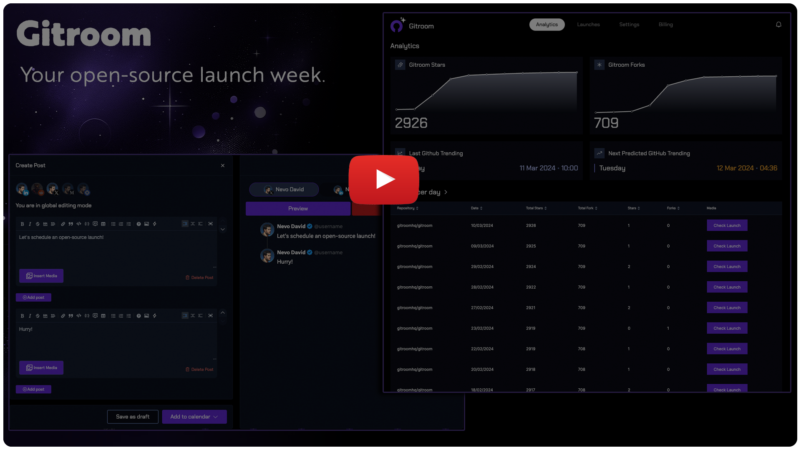
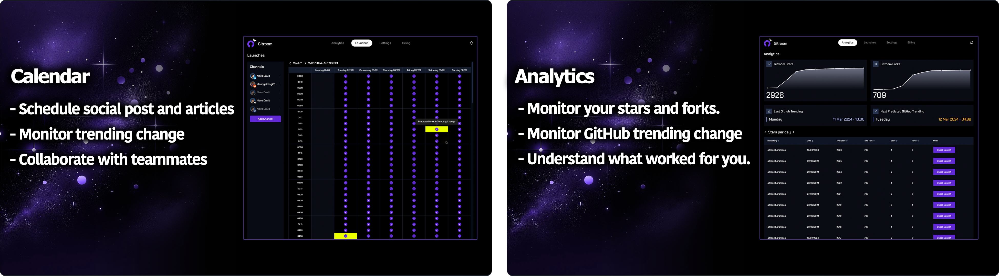
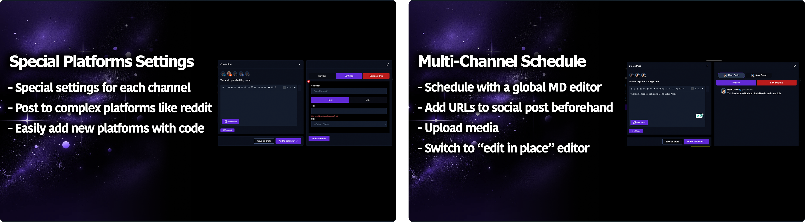
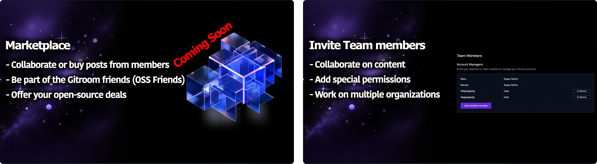

  

  

  <strong>
  <h2>Your open-source launch week.</h2>
  </strong>
  Schedule social media and articles. Exchange or buy posts from other members.  Monitor your GitHub trending, and so much more.

   
  <a href="https://docs.gitroom.com" rel="dofollow"><strong>Explore the docs »</strong></a>
   

   
    <a href="https://docs.gitroom.com/quickstart">Quick Start Guide</a>
    ·
    <a href="https://platform.gitroom.com">Register to the cloud</a>
    ·
    <a href="https://gitroom.com">Join the newsletter</a>
    ·
    <a href="https://discord.gitroom.com">Join Our Discord</a>
    ·
    <a href="https://twitter.com/nevodavid">X</a>
  

 

  

## ✨ Features

    

    

    

## Intro

<strong>Become a content machine</strong> - you might have heard it before; if you want to promote your stuff, you must release content.

To become consistent with your content, you have to set up everything before and take 1-2 weeks of a buffer (at least) so you can launch your stuff.

You want to be relaxed about the following content and not to make split-second mistakes.

Today, for open-source tools, that's impossible.  

<h3>Why?</h3>

Because you must do everything manually, even existing scheduling tools let you schedule only Social Media posts (and ignore essential platforms such as Reddit).

But how can you make your social media post if you still need to release your article?

How do you release all your articles at the same time - without copy-pasting them between platforms?

How do you know when is the best time to post?

That's where Gitroom shines; you can do all of it beforehand.

---

## Problem - Solution ✅

🚀 Schedule all your social media posts and articles beforehand.

🔥 Plan your launch around GitHub trending changes

🎉 Collaborate with other team members to exchange or buy posts

✨ Invite your team members to collaborate, comment and schedule posts

🥇 Post to uncommon platforms such as Reddit, DEV.to, and Hashnode.

💥 Offer your open-source deals to the entire community

🎈 Be a part of the Gitroom friends - APIs to exchange content between members

## Tech Stack

- NX (Monorepo)
- NextJS (React)
- NestJS
- Prisma (Default to PostgreSQL)
- Redis
- Resend (emails notifications)

## Quick Start
To have the project up and running, please follow the [Quick Start Guide](https://docs.gitroom.com/quickstart)

# License

This repository's source code is available under the [Apache 2.0 License](LICENSE).
