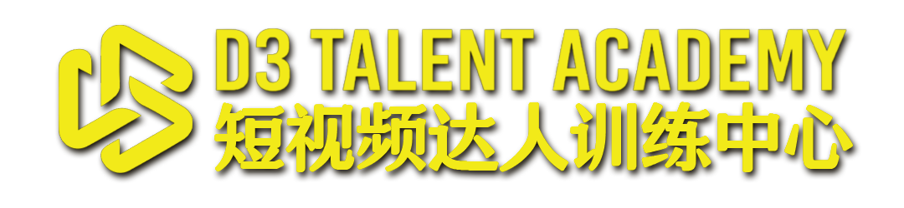

<p align="center">
  
</p>

<h2 align="center">D3 Creator — login-free social analytics</h2>

<p align="center">
Agency tool + white-label client portal. Track any public social profile by URL alone — no OAuth, no API keys.
</p>

---

## What this is

D3 Creator is a scraper-based analytics platform for agencies managing multiple creators across multiple social platforms. Paste a profile URL, get daily follower / view / engagement snapshots, weekly post-level data, and per-client reports.

**Platforms (v1 build order):** Instagram → TikTok → Facebook → RedNote → Douyin.

**Hierarchy:** Agency → Client → Creator → Profile (one per platform per account).

## Stack

- **Frontend:** Next.js App Router + React + Tailwind (Vite dev)
- **Database:** Supabase Postgres + Storage
- **Scrapers:** TikHub REST (Instagram, TikTok, RedNote, Douyin) + BrightData datasets (Facebook); one adapter file per platform
- **Hosting:** Vercel (frontend + cron + functions)
- **Scheduling:** Vercel Cron (daily snapshots) — no Temporal

## Repo layout

```
apps/frontend/                  Next.js app (D3 surface)
  src/app/(public)/             Public showcase routes
  src/components/               UI components, showcases
libraries/react-shared-libraries/src/translation/   i18n
supabase/                       Schema migrations (created in Task 2)
docs/superpowers/specs/         Design docs
```

## Local dev

```
pnpm install
pnpm dev
```

Requires PNPM. `.env` must include `NEXT_PUBLIC_SUPABASE_URL`, `NEXT_PUBLIC_SUPABASE_PUBLISHABLE_KEY`, `SUPABASE_URL`, `SUPABASE_SERVICE_ROLE_KEY`, `TIKHUB_API_KEY`, `BRIGHTDATA_API_KEY`, and `CRON_SECRET`. See `.env.local-ui.example` for the full annotated list.

For local UI work via the `frontend-local` launch configs (`.claude/launch.json`), copy the env template and fill it in:

```
cp .env.local-ui.example .env.local-ui
```

`.env.local-ui.example` documents every variable the frontend reads. `.env.local-ui` is gitignored.

## License

AGPL-3.0 (inherited from upstream fork; will revisit before public release).
